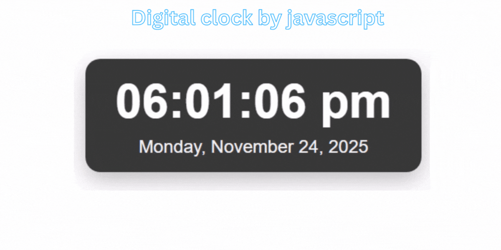

# Digital Clock

## Overview

This is a lightweight, responsive Digital Clock web component built with plain HTML, CSS and JavaScript. It displays the current local time in 12‑hour format with AM/PM, updates every second, and shows the full date (weekday, month, day, year). The code is easy to integrate into any web page and easy to customize (styles, format, locale, or behavior).

## Features

* Real-time clock that updates every second
* 12-hour format with AM/PM
* Zero-padded hours, minutes and seconds (e.g. `09:05:03`)
* Full date display (e.g. `Monday, January 1, 2025`)
* Simple, framework-free implementation (vanilla JS)
* Ready for customization (themes, localization, analog clock, animations)

## Files

* `index.html` — minimal HTML scaffold and container elements (`#time`, `#date`)
* `styles.css` — example styles (dark mode, glassmorphism, or minimal themes)
* `clock.js` — the JavaScript that updates the clock
* `README.md` — this file

## Installation

No build tools or dependencies required. Just drop the files into your project folder and open `index.html` in a browser.

## Usage

1. Place the HTML container somewhere in your page:

2. Include CSS and JS files (example):

3. The `clock.js` file will automatically run on page load and update the elements every second.

## Example JavaScript (`clock.js`)

> The example below is a clean, robust implementation using best practices.

## Accessibility

* `aria-live="polite"` on the elements helps screen readers announce updates without being too intrusive.
* Use adequate color contrast in your CSS to ensure readability for low-vision users.

## Customization Ideas

* **Localization**: Use `Intl.DateTimeFormat` to format date/time in different locales.
* **24-hour mode**: Provide a toggle to switch between 12/24-hour formats.
* **Analog clock**: Add an SVG or CSS-based analog clock alongside the digital time.
* **Theming**: Add CSS variables and a dark/light toggle.
* **Bangla date**: Convert month/day names to Bangla or use a locale like `bn-BD` with `Intl`.

## Troubleshooting

* If the clock doesn’t show up, ensure elements with IDs `time` and `date` exist before the script runs.
* If using `defer`, make sure the script is referenced in the HTML head or right before `</body>`.

## License

MIT — feel free to use and modify.

## Contribution

If you want extra features (design variants, Bangla date, analog + digital, or a packaged component), open an issue or send a pull request.
